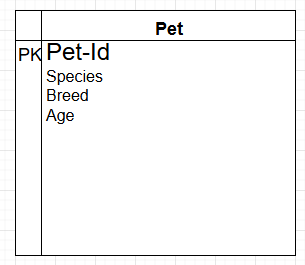
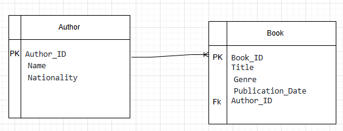
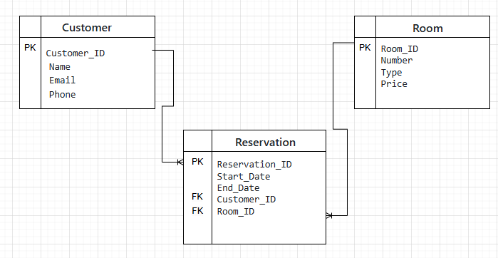

# Tarea: Modelos Entidad-Relación

## Punto 1: Modelo ER Básico - Pet Store (sin relaciones)

### Descripción
Este modelo entidad-relación representa una tienda de mascotas que gestiona información sobre las mascotas en inventario. El modelo contiene una única entidad sin relaciones con otras, ya que su objetivo es únicamente almacenar detalles básicos de cada mascota.

### Entidades
- **Pet**: Representa a las mascotas disponibles en la tienda.
  - **Atributos**:
    - `Pet_ID`: Identificador único de la mascota.
    - `Name`: Nombre de la mascota.
    - `Species`: Especie de la mascota (ej. perro, gato).
    - `Breed`: Raza de la mascota.
    - `Age`: Edad de la mascota.

---

## Punto 2: Modelo ER Básico - Biblioteca

### Descripción
Este modelo entidad-relación representa una biblioteca que administra información sobre libros y autores. Incluye dos entidades principales, **Book** y **Author**, y una relación entre ellas para indicar que cada libro es escrito por un único autor, pero un autor puede haber escrito varios libros.

### Entidades y Relaciones
- **Book**: Representa a los libros en la biblioteca.
  - **Atributos**:
    - `Book_ID`: Identificador único del libro.
    - `Title`: Título del libro.
    - `Genre`: Género literario del libro.
    - `Publication_Date`: Fecha de publicación del libro.

- **Author**: Representa a los autores de los libros en la biblioteca.
  - **Atributos**:
    - `Author_ID`: Identificador único del autor.
    - `Name`: Nombre del autor.
    - `Nationality`: Nacionalidad del autor.

- **Relación**:
  - Un **autor** puede escribir uno o más **libros**.
  - Cada **libro** está asociado con un único **autor**.

---

## Punto 3: Modelo ER Complejo - Sistema de Reservas de Hotel

### Descripción
Este modelo entidad-relación representa un sistema de reservas de hotel, gestionando información sobre clientes, habitaciones y reservas. Incluye tres entidades principales y varias relaciones para modelar las interacciones entre clientes, reservas y habitaciones.

### Entidades y Relaciones
- **Customer**: Representa a los clientes que reservan habitaciones.
  - **Atributos**:
    - `Customer_ID`: Identificador único del cliente.
    - `Name`: Nombre del cliente.
    - `Email`: Correo electrónico del cliente.
    - `Phone`: Número de teléfono del cliente.

- **Room**: Representa a las habitaciones disponibles en el hotel.
  - **Atributos**:
    - `Room_ID`: Identificador único de la habitación.
    - `Number`: Número de habitación.
    - `Type`: Tipo de habitación (ej. sencilla, doble).
    - `Price`: Precio de la habitación por noche.

- **Reservation**: Representa una reserva realizada por un cliente.
  - **Atributos**:
    - `Reservation_ID`: Identificador único de la reserva.
    - `Start_Date`: Fecha de inicio de la reserva.
    - `End_Date`: Fecha de fin de la reserva.
    - `Customer_ID`: Referencia al cliente que hizo la reserva.
    - `Room_ID`: Referencia a la habitación reservada.

- **Relaciones**:
  - Un **cliente** puede tener una o más **reservas**, pero cada **reserva** pertenece a un único **cliente**.
  - Una **habitación** puede ser reservada múltiples veces en diferentes fechas, pero cada **reserva** se asocia con una única **habitación**.

---

