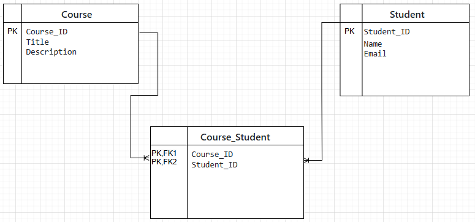
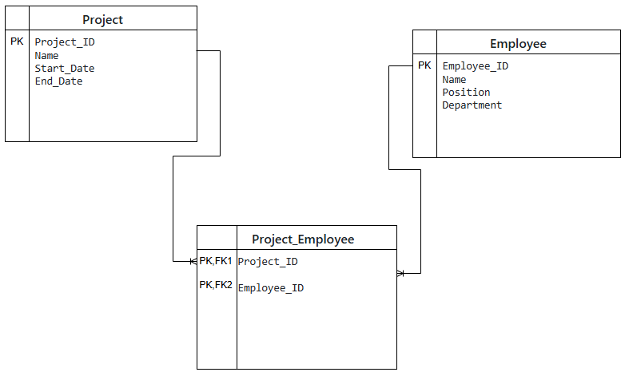
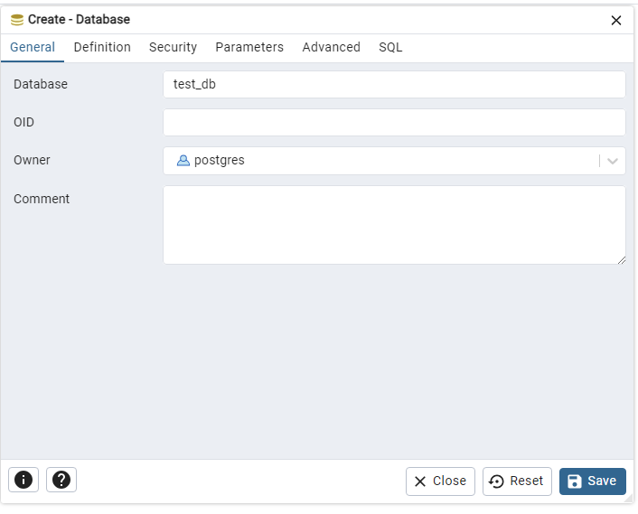
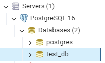

# Modelo ER y Configuración de PostgreSQL

## Punto 1: Modelo ER Básico - Courses and Students

### Descripción:
Crear un modelo entidad-relación para gestionar información sobre cursos y estudiantes con una relación muchos a muchos.

### Entidades:
- **Course**:
  - Course_ID (PK)
  - Title
  - Description

- **Student**:
  - Student_ID (PK)
  - Name
  - Email

- **Course_Student** (Entidad de relación):
  - Course_ID (FK)
  - Student_ID (FK)

### Relaciones:
- Un estudiante puede estar inscrito en uno o más cursos.
- Un curso puede tener uno o más estudiantes.

### Diagrama ER Básico:

---

## Punto 2: Modelo ER Complejo - Projects and Employees

### Descripción:
Crear un modelo entidad-relación para gestionar información sobre proyectos y empleados con una relación muchos a muchos.

### Entidades:
- **Project**:
  - Project_ID (PK)
  - Name
  - Start_Date
  - End_Date

- **Employee**:
  - Employee_ID (PK)
  - Name
  - Position
  - Department

- **Project_Employee** (Entidad de relación / Tabla pivote):
  - Project_ID (FK)
  - Employee_ID (FK)

### Relaciones:
- Un empleado puede trabajar en uno o más proyectos.
- Un proyecto puede tener uno o más empleados.

### Diagrama ER Complejo:

---

## Punto 3: Instalación de PostgreSQL y PGAdmin (Creacion Base de Datos)

