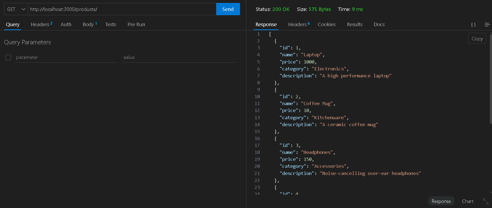
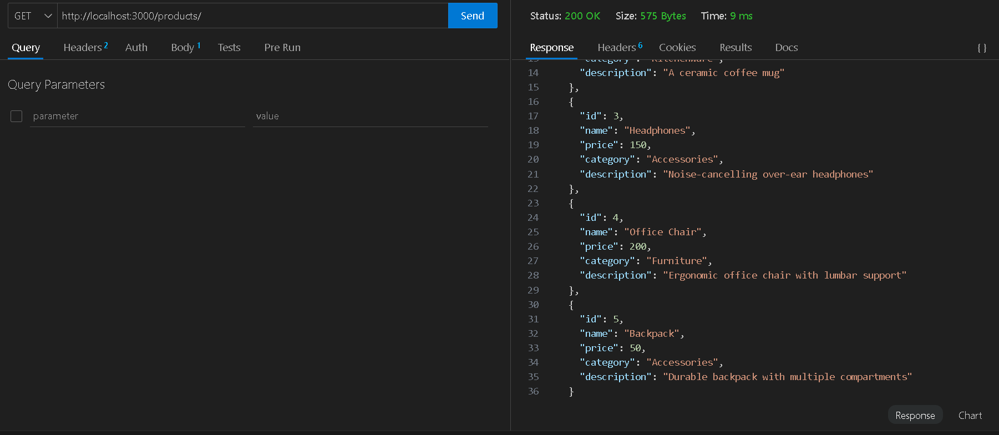
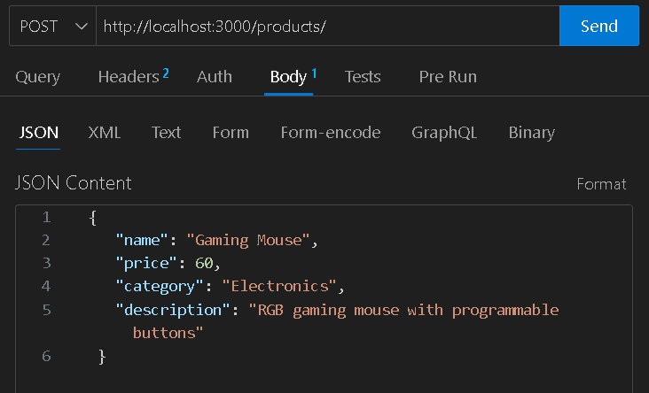
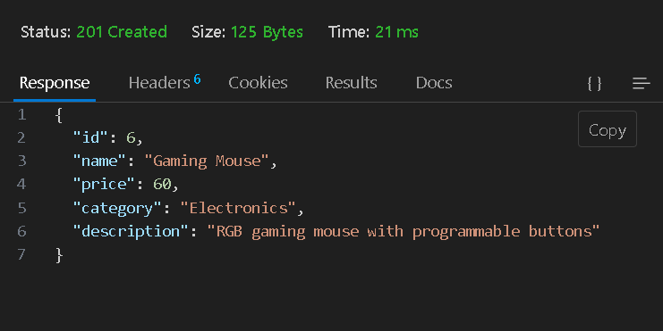
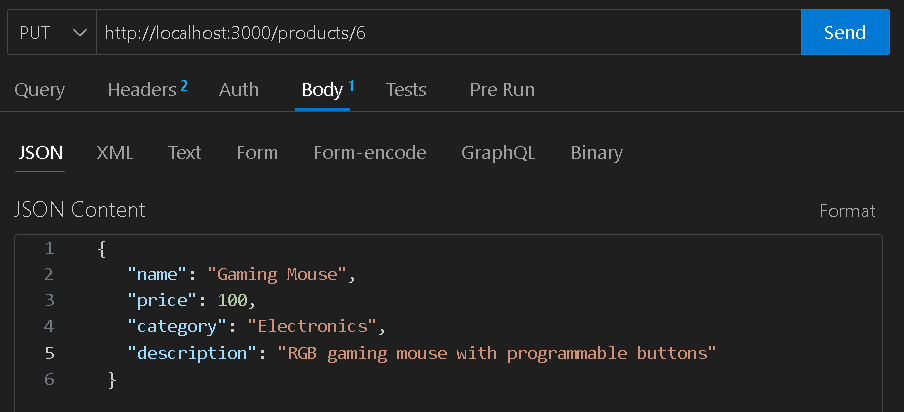
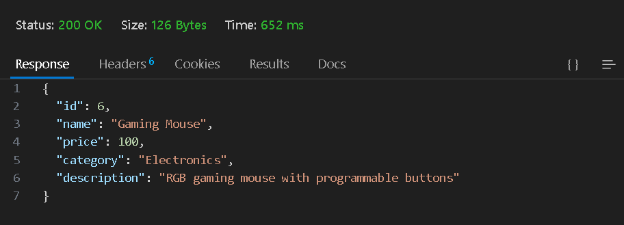
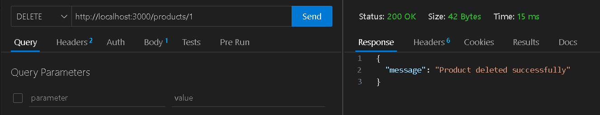
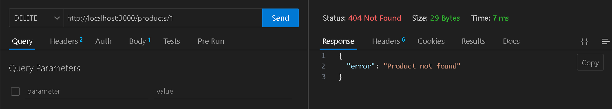

# API REST para Gestión de Productos

## Descripción

Esta API permite gestionar una lista de productos mediante operaciones CRUD (Crear, Leer, Actualizar, Eliminar). Los productos se almacenan temporalmente en memoria.

## Características

- Obtener la lista completa de productos.
- Obtener un producto específico por su ID.
- Crear un nuevo producto.
- Actualizar un producto existente.
- Eliminar un producto.

## Requisitos Previos

- [Node.js](https://nodejs.org/) (versión 18 o superior).
- npm (administrador de paquetes de Node.js).

## Instalación

1. Clona este repositorio:

   ```bash
   git clone <URL-del-repositorio>
   cd <nombre-del-directorio>
   ```

2. Instala las dependencias:

    ```bash
    npm install
    ```

## Uso

### 1. Configuración del Proyecto

Asegúrate de que la estructura del proyecto esté completa y que los archivos necesarios, como src/app.js y src/controllers/productController.js, estén presentes.

### 2. Ejecutar el Servidor

Para iniciar el servidor, ejecuta el siguiente comando:
   ```bash
   npm start
   ```


El servidor estará disponible en http://localhost:3000.

### 3. Endpoints de la API

#### Obtener todos los productos

Ruta: GET /products

Descripción: Devuelve la lista completa de productos.

Respuesta:




#### Obtener un producto por ID

Ruta: GET /products/:id

Descripción: Devuelve un producto específico.

Respuesta:




#### Crear un nuevo producto

Ruta: POST /products

Descripción: Crea un nuevo producto.

Body:

```json
{
  "name": "Gaming Mouse",
  "price": 60,
  "category": "Electronics",
  "description": "RGB gaming mouse with programmable buttons"
}

```

Respuesta:



de Respuesta:



#### Actualizar un producto

Ruta: PUT /products/:id

Descripción: Actualiza un producto existente, en este ejemplo se actualiza el precio del producto creado en el punto anterior a 100.

Body:

```json
{
  "name": "Gaming Mouse",
  "price": 100,
  "category": "Electronics",
  "description": "RGB gaming mouse with programmable buttons"
}

```



Respuesta:



#### Eliminar un producto
Ruta: DELETE /products/:id

Descripción: Elimina un producto por su ID.

Respuesta:



Cuando se intenta eliminar un producto inexistente esta es la respuesta.



## JONNY LUNA GUERRERO


